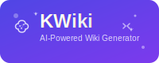

# KWiki - AI-Powered Wiki Generator for Code Repositories

<div align="center">



**🚀 智能代码文档生成工具**

[](https://golang.org/)
[](LICENSE)
[](https://github.com/stcn52/kwiki)
[](https://github.com/stcn52/kwiki/issues)
[](https://hub.docker.com/r/stcn52/kwiki)

[🚀 快速开始](#-快速开始) •
[📖 使用指南](#-使用指南) •
[⚙️ 配置说明](#️-配置说明) •
[🤝 贡献指南](#-贡献指南) •
[📞 支持](#-支持与反馈)

</div>

---

## 🌟 项目简介

**KWiki** 是一个基于 AI 的智能代码文档生成工具，能够自动分析 GitHub/GitLab 代码仓库，生成结构化、多语言的 Wiki 文档。通过先进的 AI 技术，KWiki 可以理解代码结构、识别关键组件，并生成包含架构图、API 文档、使用指南等完整文档体系。

### 🎯 核心价值

- **🤖 AI 驱动**：利用多种 AI 模型深度理解代码逻辑
- **📊 可视化**：自动生成架构图和流程图
- **🌍 多语言**：支持中英日韩等多种语言文档
- **🔍 智能搜索**：基于 RAG 的文档问答系统
- **⚡ 高效率**：几分钟内生成完整项目文档

## ✨ 核心特性

### 🤖 多 AI 提供商支持
- **DeepSeek**：成本低廉，中文支持优秀
- **OpenAI GPT**：高质量输出，支持最新模型
- **Google Gemini**：免费额度高，多模态支持
- **Ollama**：本地部署，数据安全可控

### 📊 智能代码分析
- 自动识别项目架构和技术栈
- 分析依赖关系和模块结构
- 提取关键函数和 API 接口
- 生成代码调用关系图

### 🌍 多语言文档生成
- 支持中文、英文、日文、韩文等
- 可同时生成多语言版本
- 智能翻译技术术语
- 保持技术文档的准确性

### 📈 可视化图表
- **架构图**：系统整体架构展示
- **流程图**：业务流程和数据流
- **依赖图**：模块依赖关系
- **API 图**：接口调用关系

### 🔍 智能搜索与问答
- 基于 RAG 的语义搜索
- 自然语言问答系统
- 代码片段快速定位
- 上下文相关的智能推荐

### 📱 现代化 Web 界面
- 响应式设计，支持移动端
- 实时进度显示和日志查看
- 直观的文档浏览体验
- 支持主题定制

## 🎯 适用场景

| 场景 | 描述 | 收益 |
|------|------|------|
| **开源项目** | 为 GitHub 项目自动生成文档 | 提升项目可读性，吸引更多贡献者 |
| **企业内部** | 为内部代码仓库生成标准化文档 | 降低维护成本，提高开发效率 |
| **API 文档** | 自动分析接口并生成 API 文档 | 减少手工维护，保证文档同步 |
| **代码审查** | 快速了解项目结构和核心逻辑 | 提高审查效率，降低理解成本 |
| **新人培训** | 为新团队成员提供项目概览 | 加速上手过程，减少培训时间 |

## 🚀 快速开始

### 📋 环境要求

- **Go**: 1.24 或更高版本
- **内存**: 建议 4GB 以上
- **存储**: 至少 1GB 可用空间
- **网络**: 访问 AI 服务商 API（或本地 Ollama）

### 🎯 方式一：一键启动（推荐）

```bash
# 1. 克隆仓库
git clone https://github.com/stcn52/kwiki.git
cd kwiki

# 2. 配置环境变量
cp .env.example .env
# 编辑 .env 文件，添加至少一个 AI 提供商的 API 密钥

# 3. 一键启动
./start.sh
```

### 🐳 方式二：Docker 部署

```bash
# 快速启动
docker run -d \
  --name kwiki \
  -p 8080:8080 \
  -e DEEPSEEK_API_KEY="your-api-key" \
  -v $(pwd)/data:/app/data \
  stcn52/kwiki:latest

# 使用 Docker Compose
curl -O https://raw.githubusercontent.com/stcn52/kwiki/main/docker-compose.yml
docker-compose up -d
```

### 📦 方式三：预编译二进制

```bash
# 下载最新版本
wget https://github.com/stcn52/kwiki/releases/latest/download/kwiki-linux-amd64.tar.gz
tar -xzf kwiki-linux-amd64.tar.gz

# 运行
./kwiki -config config.yaml
```

### 🌐 访问应用

启动成功后，打开浏览器访问：`http://localhost:8080`

## 📖 使用指南

### 🎬 生成第一个 Wiki

1. **输入仓库信息**
   - 在首页输入 GitHub/GitLab 仓库 URL
   - 如果是私有仓库，提供访问令牌

2. **选择 AI 配置**
   - 选择 AI 提供商（DeepSeek/OpenAI/Gemini/Ollama）
   - 选择合适的模型
   - 调整生成参数

3. **配置生成选项**
   - 选择文档语言（支持多语言同时生成）
   - 启用图表生成
   - 配置其他高级选项

4. **开始生成**
   - 点击"Generate Wiki"
   - 实时查看生成进度
   - 查看详细日志

### 🔍 浏览和搜索文档

#### 访问方式
- **包路径访问**：`http://localhost:8080/pkg/github.com/owner/repo`
- **Wiki ID 访问**：`http://localhost:8080/wiki/wiki-id`
- **特定页面**：`http://localhost:8080/wiki/wiki-id/page/page-id`

#### 搜索功能
- **关键词搜索**：在搜索框输入关键词
- **智能问答**：使用自然语言提问
- **代码搜索**：搜索特定函数或类
- **标签过滤**：按标签筛选内容

### 🔄 管理 Wiki

#### 重新生成
- 点击 Wiki 卡片上的"Rebuild"按钮
- 确认重新生成操作
- 系统将使用最新代码重新生成文档

#### 删除 Wiki
- 点击"Delete"按钮
- 确认删除操作
- 系统将删除所有相关文件

#### 导出文档
- 支持 Markdown、HTML、PDF 格式
- 可选择导出特定页面或整个 Wiki
- 支持批量导出

## ⚙️ 配置说明

### AI 提供商配置

KWiki 支持多种 AI 提供商，你可以根据需要配置：

#### DeepSeek（推荐）
```bash
export DEEPSEEK_API_KEY="sk-your-deepseek-api-key"
```
- 成本低廉，性能优秀
- 支持长文本处理
- 中文支持良好

#### OpenAI
```bash
export OPENAI_API_KEY="sk-your-openai-api-key"
```
- 高质量输出
- 支持最新的 GPT 模型

#### Google Gemini
```bash
export GOOGLE_API_KEY="your-google-api-key"
```
- 免费额度较高
- 多模态支持

#### Ollama（本地部署）
```bash
# 安装 Ollama
curl -fsSL https://ollama.ai/install.sh | sh

# 下载模型
ollama pull llama3.2:latest

# 启动服务（默认端口 11434）
ollama serve
```

### 配置文件

编辑 `config.yaml` 自定义配置：

```yaml
server:
  port: "8080"
  host: "0.0.0.0"
  data_dir: "./data"
  static_dir: "./web/static"
  template_dir: "./web/templates"

ai:
  default_provider: "deepseek"
  providers:
    deepseek:
      api_key: "${DEEPSEEK_API_KEY}"
      model: "deepseek-chat"
      temperature: 0.7
      max_tokens: 8000

    openai:
      api_key: "${OPENAI_API_KEY}"
      model: "gpt-4o-mini"
      temperature: 0.7
      max_tokens: 4000

analysis:
  max_file_size: 1048576  # 1MB
  include_patterns:
    - "*.go"
    - "*.py"
    - "*.js"
    - "*.ts"
    - "*.java"
    - "*.cpp"
    - "*.c"
    - "*.h"
    - "*.md"
    - "*.yml"
    - "*.yaml"
    - "*.json"
  exclude_patterns:
    - "vendor/*"
    - "node_modules/*"
    - ".git/*"
    - "*.min.js"
    - "*.min.css"
```

## 🏗️ 项目结构

```
kwiki/
├── cmd/kwiki/              # 应用入口
├── internal/               # 内部包
│   ├── ai/                # AI 提供商实现
│   │   ├── deepseek.go    # DeepSeek 提供商
│   │   ├── openai.go      # OpenAI 提供商
│   │   ├── gemini.go      # Google Gemini 提供商
│   │   └── ollama.go      # Ollama 提供商
│   ├── analyzer/          # 代码分析器
│   ├── config/            # 配置管理
│   ├── generator/         # Wiki 生成器
│   ├── server/            # Web 服务器
│   └── storage/           # 存储系统
├── pkg/                   # 公共包
│   ├── models/            # 数据模型
│   └── utils/             # 工具函数
├── web/                   # Web 资源
│   ├── static/            # 静态文件
│   └── templates/         # HTML 模板
├── data/                  # 数据目录
│   └── wikis/             # Wiki 存储
├── config.yaml            # 配置文件
├── Dockerfile             # Docker 构建文件
├── docker-compose.yml     # Docker Compose 配置
└── start.sh              # 启动脚本
```

## 🔧 开发指南

### 环境要求

- Go 1.24+
- Node.js 16+ (用于前端资源处理)
- Git

### 本地开发

1. **克隆仓库**
```bash
git clone https://github.com/stcn52/kwiki.git
cd kwiki
```

2. **安装依赖**
```bash
go mod download
```

3. **运行测试**
```bash
go test ./...
```

4. **启动开发服务器**
```bash
go run cmd/kwiki/main.go -config config.yaml
```

### 添加新的 AI 提供商

1. 在 `internal/ai/` 目录下创建新的提供商文件
2. 实现 `Provider` 接口：
```go
type Provider interface {
    GenerateContent(ctx context.Context, prompt string, options ...Option) (string, error)
    GetModels() []string
    IsAvailable() bool
}
```
3. 在 `internal/server/server.go` 中注册提供商

### 扩展代码分析

1. 在 `internal/analyzer/analyzer.go` 中添加新的语言支持
2. 扩展 `detectLanguage` 和相关解析函数
3. 更新配置文件中的 `include_patterns`

## 📊 性能优化

### 生成速度优化

- **并行处理**：支持多文件并行分析
- **缓存机制**：智能缓存分析结果
- **增量更新**：只处理变更的文件

### 资源使用优化

- **内存管理**：流式处理大文件
- **存储优化**：压缩存储生成的文档
- **网络优化**：支持 HTTP/2 和 gzip 压缩

## 🔒 安全考虑

- **API 密钥保护**：环境变量存储，不记录日志
- **输入验证**：严格验证用户输入
- **文件访问控制**：限制文件访问范围
- **速率限制**：防止 API 滥用

## 🤝 贡献指南

我们欢迎所有形式的贡献！

### 贡献方式

1. **报告问题**：在 [Issues](https://github.com/stcn52/kwiki/issues) 中报告 bug
2. **功能建议**：提出新功能想法
3. **代码贡献**：提交 Pull Request
4. **文档改进**：完善文档和示例

### 开发流程

1. Fork 项目
2. 创建特性分支：`git checkout -b feature/amazing-feature`
3. 提交更改：`git commit -m 'Add amazing feature'`
4. 推送分支：`git push origin feature/amazing-feature`
5. 创建 Pull Request

### 代码规范

- 遵循 Go 官方代码规范
- 添加必要的注释和文档
- 编写单元测试
- 确保所有测试通过

## 📄 许可证

本项目采用 MIT 许可证 - 查看 [LICENSE](LICENSE) 文件了解详情。

## 🙏 致谢

感谢以下开源项目和服务：

- [DeepSeek](https://www.deepseek.com/) - 高性能 AI 模型
- [OpenAI](https://openai.com/) - GPT 模型 API
- [Google Gemini](https://ai.google.dev/) - Gemini 模型 API
- [Ollama](https://ollama.ai/) - 本地 AI 模型运行
- [Gin](https://gin-gonic.com/) - Go Web 框架
- [Mermaid](https://mermaid.js.org/) - 图表生成
- [Alpine.js](https://alpinejs.dev/) - 轻量级前端框架
- [Tailwind CSS](https://tailwindcss.com/) - CSS 框架

## 📞 支持与反馈

如果你遇到问题或有建议，请：

1. 查看 [FAQ](https://github.com/stcn52/kwiki/wiki/FAQ)
2. 搜索现有 [Issues](https://github.com/stcn52/kwiki/issues)
3. 创建新的 Issue
4. 加入我们的讨论群

## 🗺️ 路线图

### v1.1.0 (计划中)
- [ ] 支持更多编程语言
- [ ] 增强图表生成能力
- [ ] 添加主题定制功能
- [ ] 支持团队协作功能

### v1.2.0 (计划中)
- [ ] 集成 CI/CD 工具
- [ ] 支持 API 文档自动生成
- [ ] 添加文档版本管理
- [ ] 支持自定义模板

### v2.0.0 (远期规划)
- [ ] 插件系统
- [ ] 云端部署支持
- [ ] 企业级功能
- [ ] 多租户支持

---

<div align="center">

**⭐ 如果这个项目对你有帮助，请给我们一个 Star！**

[🏠 首页](https://github.com/stcn52/kwiki) •
[📖 文档](https://github.com/stcn52/kwiki/wiki) •
[🐛 报告问题](https://github.com/stcn52/kwiki/issues) •
[💡 功能建议](https://github.com/stcn52/kwiki/discussions)

</div>